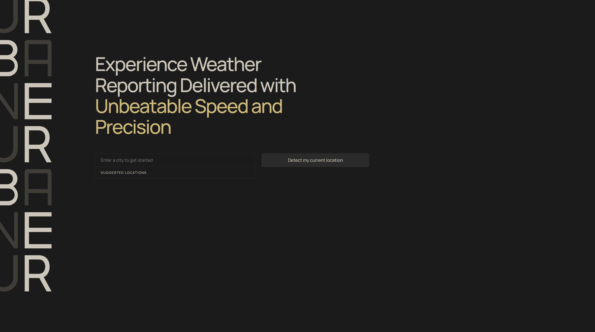
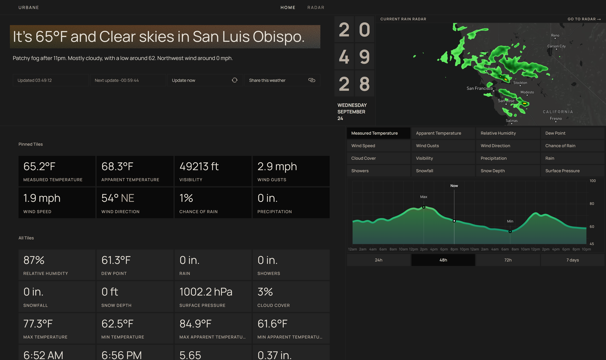
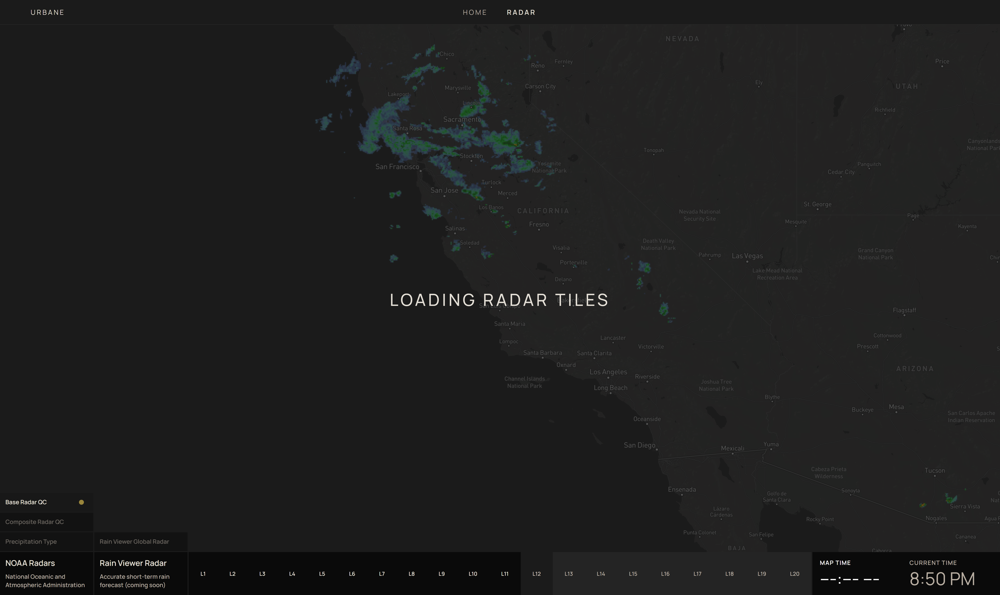
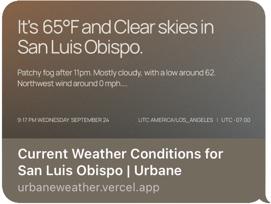
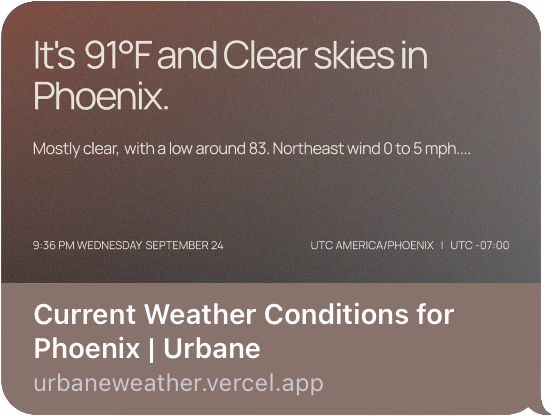
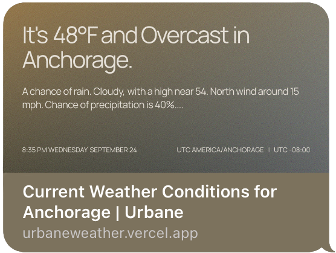

# Urbane Weather
This project is an ultra-modern, highly granular weather application designed to provide users with accurate weather data. It features an interactive radar system, advanced data visualization, and a customizable dashboard. The application is built using Next.js, React, Mapbox GL, and Chart.js, and is deployed on Vercel.

## Current Snapshots

#### Landing Page

#### Home Page

#### Loading and Radar Tiles

# Notable Features

**Radar with Mapbox GL**: This project integrates NOAA's WMS geoserver with Mapbox GL to create an interactive and fluid weather radar system. It queries NOAA's GetCapabilities service, parses XML responses, and transforms temporal radar data into animated tile layers. The system features time-scrubbing functionality through custom range slider controls, automatic radar animation loops, and dynamic layer management with selective rendering.

**Data Analysis**: This project implements Chart.js with custom gradient backgrounds for advanced weather visualization across multiple timeframes (24h, 48h, 72h, 7d). The charting system includes tooltips, data point highlighting, and animations that enhance the user experience.

**Intentional Design System**: Features a CSS Grid layout that allows for granular data customization. Users can pin different weather data tiles to their home dashboard based on their preferences.

**Meta Tags and SEO**: This project uses experimental edge functions in Vercel to dynamically generate meta tags for each page, enhancing SEO and social media sharing capabilities. See some examples below:

    
    
    

# Usage
You can try out the application by visiting [urbaneweather.vercel.app](https://urbaneweather.vercel.app/)